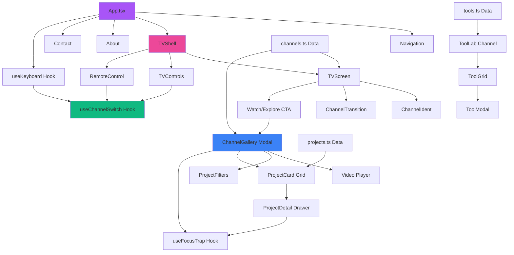
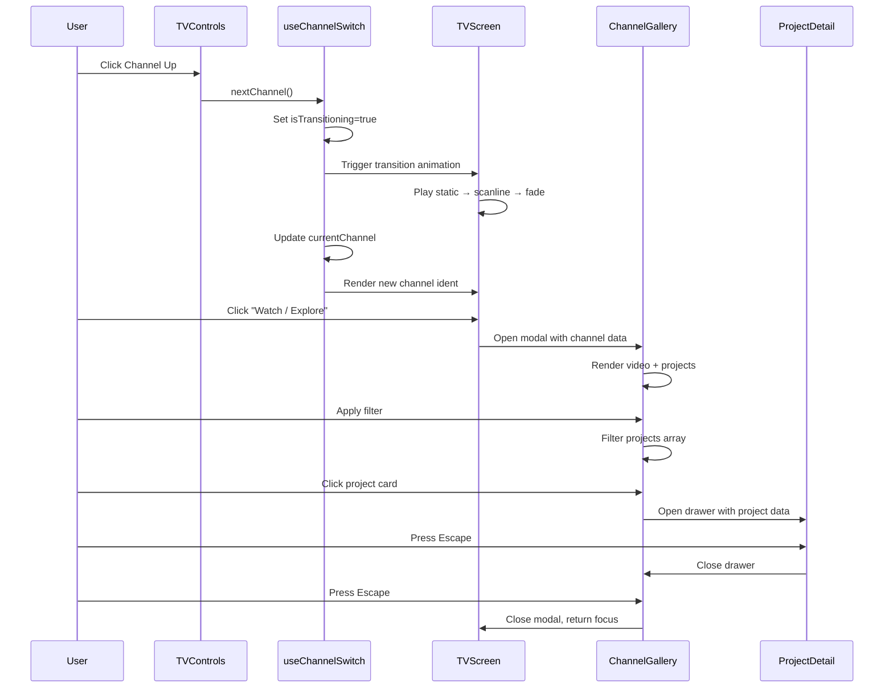

I have created the following plan after thorough exploration and analysis of the codebase. Follow the below plan verbatim. Trust the files and references. Do not re-verify what's written in the plan. Explore only when absolutely necessary. First implement all the proposed file changes and then I'll review all the changes together at the end.

## Observations

This is a greenfield project in an empty workspace. The requirement is to build a single-page portfolio website with a unique "Living Television" metaphor, where channels represent different project categories. The tech stack (React + Vite + TypeScript + Tailwind) is modern and appropriate for a static, performant site. The UX centers on nostalgic TV interactions (channel switching, remote control) combined with contemporary web patterns (modals, filters, keyboard shortcuts).

## Approach

The implementation will follow a component-driven architecture with React, using a centralized data model (TypeScript interfaces + JSON/TS data file) to drive all content. The TV interface will be the hero component, with state management handling channel switching, overlay modals, and animations. Tailwind will handle responsive design and utility-first styling, while custom CSS will add TV-specific effects (scanlines, chromatic aberration). The project structure will prioritize maintainability and easy content updates through a single data source.

---

## Implementation Plan

### **1. Project Initialization & Structure**

Initialize a Vite + React + TypeScript project with Tailwind CSS configured. Create the following directory structure:

```
src/
├── components/
│   ├── TV/
│   │   ├── TVShell.tsx
│   │   ├── TVScreen.tsx
│   │   ├── TVControls.tsx
│   │   ├── RemoteControl.tsx
│   │   └── ChannelTransition.tsx
│   ├── Channel/
│   │   ├── ChannelIdent.tsx
│   │   ├── ChannelInfo.tsx
│   │   └── ChannelGallery.tsx
│   ├── Project/
│   │   ├── ProjectCard.tsx
│   │   ├── ProjectDetail.tsx
│   │   └── ProjectFilters.tsx
│   ├── ToolLab/
│   │   ├── ToolGrid.tsx
│   │   ├── ToolCard.tsx
│   │   └── ToolModal.tsx
│   ├── Layout/
│   │   ├── Navigation.tsx
│   │   ├── About.tsx
│   │   └── Contact.tsx
│   └── shared/
│       ├── Modal.tsx
│       ├── Button.tsx
│       └── Badge.tsx
├── data/
│   ├── channels.ts
│   ├── projects.ts
│   ├── tools.ts
│   └── types.ts
├── hooks/
│   ├── useKeyboard.ts
│   ├── useChannelSwitch.ts
│   └── useFocusTrap.ts
├── styles/
│   ├── tv-effects.css
│   └── animations.css
├── utils/
│   └── constants.ts
├── App.tsx
└── main.tsx
```

---

### **2. Data Model & Type Definitions**

Create TypeScript interfaces in `file:src/data/types.ts`:

- `Channel`: id, number, name, accentColor, description, identMedia, icon, projects[]
- `Project`: id, title, brief, typeTags[], softwareTags[], aiToolTags[], duration, year, thumbUrl, videoUrl, caseStudyUrl, role, deliverables[], notes
- `Tool`: id, name, logoUrl, description, workflow, useCases[], exampleThumbs[], links[]

Populate `file:src/data/channels.ts` with 7 channels (CH 01–07) matching the requirements, each with unique accent colors (gradients: purple-pink for AI Style, orange-red for Short Form, blue-cyan for Long Form, green-teal for Podcast, yellow-amber for Motion Graphics, indigo-violet for 3D, rainbow for Tool Lab).

Populate `file:src/data/projects.ts` with 2–3 placeholder projects per channel (14–21 total), using realistic metadata (e.g., "AI Style Transfer Reel" with tags: AI Style, After Effects, Midjourney, 2024, 45s duration).

Populate `file:src/data/tools.ts` with Tool Lab entries: Nano Banana, Midjourney, Higgsfield, Stable Diffusion, Sora, Runway, Pika, Kling, Veo, ElevenLabs, Topaz, DaVinci Resolve—each with placeholder descriptions and workflow notes.

---

### **3. TV Shell & Screen Components**

**TVShell Component** (`file:src/components/TV/TVShell.tsx`):
- Render a centered container with CSS for depth (box-shadow, border-radius, subtle gradient background mimicking plastic/metal)
- Add pseudo-elements for screen bezel, reflection overlay (linear-gradient with low opacity), and stand/base
- Use Tailwind responsive classes: full-width on mobile, max-w-4xl on desktop
- Apply `transform: perspective()` for subtle 3D tilt effect

**TVScreen Component** (`file:src/components/TV/TVScreen.tsx`):
- Display the active channel's ident media (video loop or animated placeholder)
- Overlay scanline effect via CSS (repeating-linear-gradient with 1px lines, low opacity)
- Add chromatic aberration using CSS filters or pseudo-element with slight RGB offset
- Include soft bloom/glow with box-shadow and backdrop-filter
- Render channel number badge (top-right corner) and "Watch / Explore" CTA button (bottom-center, appears on hover/focus)
- Respect `prefers-reduced-motion` media query to disable animations

**TVControls Component** (`file:src/components/TV/TVControls.tsx`):
- Position below or beside TV screen (responsive: bottom bar on mobile, side panel on desktop)
- Buttons: Power (toggle on/off state), Channel Up/Down (increment/decrement channel index with wrap-around), Channel List (open overlay), Volume Slider (visual only, 0–100 range), Info (show channel description modal)
- Use icon library (e.g., Lucide React or Heroicons) for button icons
- Apply ARIA labels: `aria-label="Channel up"`, `role="button"`, `aria-pressed` for power

**RemoteControl Component** (`file:src/components/TV/RemoteControl.tsx`):
- Optional floating component (position: fixed, bottom-right on desktop, hidden on mobile or toggleable)
- Mirror TV controls with same functionality
- Style as a physical remote: rounded rectangle, button grid, nostalgic color scheme (dark gray with colored accent buttons)

---

### **4. Channel Switching Logic & Animations**

**useChannelSwitch Hook** (`file:src/hooks/useChannelSwitch.ts`):
- Manage state: `currentChannel` (index), `isPoweredOn` (boolean), `isTransitioning` (boolean)
- Functions: `nextChannel()`, `prevChannel()`, `goToChannel(index)`, `togglePower()`
- On channel change, set `isTransitioning: true`, trigger animation sequence (300ms), then update `currentChannel` and set `isTransitioning: false`

**ChannelTransition Component** (`file:src/components/TV/ChannelTransition.tsx`):
- Render full-screen overlay during transition
- Animation sequence: 
  1. Static noise (CSS animation with random pixel pattern or animated GIF overlay, 150ms)
  2. Scanline sweep (horizontal line moving top-to-bottom, 100ms)
  3. Crossfade to new channel (opacity transition, 150ms)
- Use Framer Motion or CSS keyframes for smooth 60fps animations
- Conditionally render based on `isTransitioning` state

---

### **5. Keyboard Navigation**

**useKeyboard Hook** (`file:src/hooks/useKeyboard.ts`):
- Attach global event listener to `window` for `keydown` events
- Map keys:
  - `ArrowUp` → `prevChannel()`
  - `ArrowDown` → `nextChannel()`
  - `Enter` → open current channel gallery
  - `Escape` → close all modals/overlays
- Prevent default behavior when modals are open (except Escape)
- Clean up listener on unmount

---

### **6. Channel Gallery Overlay**

**ChannelGallery Component** (`file:src/components/Channel/ChannelGallery.tsx`):
- Full-screen modal (fixed position, z-index: 50, backdrop with blur)
- Layout: CSS Grid with two columns on desktop (60% left for video, 40% right for projects), single column on mobile
- Left panel: Featured video player (iframe for YouTube/Vimeo with `loading="lazy"`, or `<video>` tag for local mp4 with controls)
- Right panel: Scrollable project list with filters at top
- Close button (top-right, X icon) and Escape key handler

**ProjectFilters Component** (`file:src/components/Project/ProjectFilters.tsx`):
- Three filter groups: Type, Software, AI Tools
- Render as pill buttons (Tailwind: `rounded-full`, `px-4 py-2`, active state with accent color)
- State: `activeFilters` (array of selected tags)
- Filter logic: show projects where `project.typeTags.includes(filter)` OR `project.softwareTags.includes(filter)` OR `project.aiToolTags.includes(filter)`
- "Clear All" button to reset filters

**ProjectCard Component** (`file:src/components/Project/ProjectCard.tsx`):
- Display thumbnail (lazy-loaded `` with `loading="lazy"`), title, duration, year
- Render tag badges (small chips with channel accent color)
- Click handler to open `ProjectDetail` drawer

---

### **7. Project Detail Drawer**

**ProjectDetail Component** (`file:src/components/Project/ProjectDetail.tsx`):
- Slide-in drawer from right (CSS transition: `transform: translateX(100%)` to `translateX(0)`)
- Content sections:
  - Title (h2)
  - Brief (2 sentences, p tag)
  - Role badges (Edit, Color, Sound, Comp, 3D—render as colored chips)
  - Tool stack (Software + AI Tools as icon badges)
  - Deliverables list (Reel, Ad, Trailer, etc.—bulleted list)
- Action buttons: "Watch" (open video in modal or new tab), "Case Study" (placeholder link), "Download Breakdown" (placeholder download)
- Close button and Escape key support

**useFocusTrap Hook** (`file:src/hooks/useFocusTrap.ts`):
- Trap focus within modal/drawer when open
- Query all focusable elements (`button`, `a`, `input`, etc.)
- On Tab key, cycle through elements; on Shift+Tab, reverse cycle
- Restore focus to trigger element on close

---

### **8. Tool Lab Channel**

**ToolGrid Component** (`file:src/components/ToolLab/ToolGrid.tsx`):
- Render grid of tool cards (CSS Grid: 3 columns on desktop, 2 on tablet, 1 on mobile)
- Each card shows tool logo (placeholder image or icon), name, and short tagline
- Click handler to open `ToolModal`

**ToolModal Component** (`file:src/components/ToolLab/ToolModal.tsx`):
- Centered modal (max-w-2xl)
- Sections:
  - Tool name + logo (header)
  - "What I use it for" (paragraph)
  - "Typical workflow" (ordered list or steps)
  - Example thumbnails (3 images in a row, lazy-loaded)
  - Links (placeholder buttons: "Official Site", "Tutorials", "My Work")
- Close button and backdrop click to dismiss

---

### **9. Navigation & Additional Pages**

**Navigation Component** (`file:src/components/Layout/Navigation.tsx`):
- Fixed top bar (sticky on scroll) with logo/title on left, nav links on right
- Links: Home, Channels (dropdown or modal with channel list), About, Contact
- Mobile: hamburger menu that expands to full-screen overlay
- Active link styling with underline or accent color

**About Component** (`file:src/components/Layout/About.tsx`):
- Hero section: short bio (2–3 paragraphs)
- Skills matrix: two-column grid (Software | AI Tools) with icon badges
- Process steps: numbered list or timeline (Discovery → Concept → Production → Delivery)
- Use channel accent colors for section dividers

**Contact Component** (`file:src/components/Layout/Contact.tsx`):
- Centered card with email button (mailto: link) and social media icons (placeholders: LinkedIn, Twitter, Instagram, YouTube, Vimeo)
- Optional contact form (name, email, message fields) with placeholder submit handler

---

### **10. Visual Effects & Styling**

**TV Effects CSS** (`file:src/styles/tv-effects.css`):
- Scanlines: `background: repeating-linear-gradient(0deg, rgba(0,0,0,0.1) 0px, transparent 1px, transparent 2px);`
- Chromatic aberration: pseudo-element with `mix-blend-mode: screen` and slight `transform: translate(2px, 0)` with red/blue tint
- Bloom/glow: `box-shadow: 0 0 20px rgba(255,255,255,0.3), inset 0 0 20px rgba(255,255,255,0.1);`
- Screen flicker (optional): subtle `@keyframes flicker` with opacity changes

**Animations CSS** (`file:src/styles/animations.css`):
- Channel transition: `@keyframes staticNoise`, `@keyframes scanlineSwipe`, `@keyframes fadeIn`
- Modal enter/exit: `@keyframes slideUp`, `@keyframes fadeInBackdrop`
- Button hover: scale and color transitions
- Respect `@media (prefers-reduced-motion: reduce)` to disable or simplify animations

**Tailwind Configuration** (`tailwind.config.js`):
- Extend theme with custom colors for each channel accent (e.g., `aiStyle: { from: '#a855f7', to: '#ec4899' }`)
- Add custom animations: `animation: { 'spin-slow': 'spin 3s linear infinite', 'pulse-subtle': 'pulse 4s ease-in-out infinite' }`
- Configure responsive breakpoints if needed

---

### **11. Performance Optimizations**

- **Lazy Loading**: Use React `lazy()` and `Suspense` for route-based code splitting (About, Contact pages)
- **Image Optimization**: Serve images in WebP format with fallback, use `srcset` for responsive images
- **Video Loading**: Set `preload="metadata"` on video tags, use poster images
- **Bundle Size**: Tree-shake unused Tailwind classes with PurgeCSS (built into Tailwind), avoid heavy animation libraries (prefer CSS or lightweight Framer Motion)
- **Lighthouse Targets**: Aim for 90+ Performance, 100 Accessibility, 100 Best Practices, 100 SEO

---

### **12. Accessibility Implementation**

- **ARIA Labels**: All interactive elements have descriptive `aria-label` or `aria-labelledby`
- **Focus Management**: Visible focus indicators (Tailwind: `focus:ring-2 focus:ring-offset-2`), focus trap in modals
- **Keyboard Navigation**: Full keyboard support (Tab, Enter, Escape, Arrow keys)
- **Color Contrast**: Ensure WCAG AA compliance (4.5:1 for text, 3:1 for UI components)—test with Tailwind's default palette or adjust
- **Screen Reader Support**: Semantic HTML (`<nav>`, `<main>`, `<article>`, `<button>`), `role` attributes where needed, `aria-live` for dynamic content (channel changes)
- **Reduced Motion**: Disable animations for users with `prefers-reduced-motion: reduce`

---

### **13. Mobile Responsiveness**

- **TV Scaling**: Use `max-w-full` and `aspect-ratio: 16/9` for TV screen, scale down on small screens
- **Control Layout**: Stack controls vertically on mobile, use bottom fixed bar for primary actions (Channel Up/Down, Power)
- **Remote Control**: Hide on mobile or make toggleable via floating button
- **Gallery Overlay**: Single-column layout on mobile (video on top, projects below), full-screen takeover
- **Touch Gestures**: Consider swipe gestures for channel switching (optional, using touch event listeners)
- **Breakpoints**: Mobile (<640px), Tablet (640px–1024px), Desktop (>1024px)

---

### **14. README Documentation**

Create `README.md` with the following sections:

**Getting Started**:
```bash
npm install
npm run dev
```

**Project Structure**: Brief explanation of directory layout

**Replacing Placeholder Content**:
- Edit `file:src/data/channels.ts` to update channel descriptions and ident media URLs
- Edit `file:src/data/projects.ts` to add real project data (update `thumbUrl`, `videoUrl`, `caseStudyUrl`)
- Edit `file:src/data/tools.ts` to customize Tool Lab entries
- Replace placeholder images in `public/images/` directory

**Adding a New Channel**:
1. Add channel object to `channels` array in `file:src/data/channels.ts`
2. Assign unique `id`, `number`, `name`, `accentColor`, `description`, `identMedia`
3. Add projects to `projects` array with matching channel reference
4. Update channel icon in `file:src/utils/constants.ts` if using icon mapping

**Adding a New Project**:
1. Add project object to `projects` array in `file:src/data/projects.ts`
2. Include all required fields: `id`, `title`, `brief`, `typeTags`, `softwareTags`, `aiToolTags`, `thumbUrl`, `videoUrl`, etc.
3. Ensure `thumbUrl` points to valid image (or use placeholder service like `https://placehold.co/600x400`)

**Deployment**:
```bash
npm run build
# Deploy 'dist' folder to Netlify, Vercel, GitHub Pages, or any static host
```

**Customization Tips**:
- Adjust channel accent colors in Tailwind config
- Modify TV shell styling in `file:src/components/TV/TVShell.tsx`
- Customize transition animations in `file:src/styles/animations.css`

---

### **15. Testing & Validation**

**Acceptance Criteria Checklist**:
- [ ] Channel switching updates TV screen and channel info immediately
- [ ] Channel transition animation plays smoothly (static → scanline → crossfade)
- [ ] Opening a channel gallery displays projects with correct filters
- [ ] Filters work correctly (Type, Software, AI Tools)
- [ ] Project detail drawer opens and closes reliably
- [ ] Keyboard navigation works (Arrow keys, Enter, Escape)
- [ ] Mobile layout is fully functional (controls, gallery, modals)
- [ ] Power button toggles TV on/off state
- [ ] Tool Lab displays all tools and modals open correctly
- [ ] About and Contact pages render properly
- [ ] All interactive elements are keyboard-accessible
- [ ] Focus indicators are visible
- [ ] Screen reader announces channel changes

**Manual Testing Steps**:
1. Load site, verify TV appears centered with default channel
2. Click Channel Up/Down, confirm smooth transitions
3. Press Arrow keys, confirm keyboard control works
4. Click "Watch / Explore" on a channel, verify gallery opens
5. Apply filters, confirm project list updates
6. Click project card, verify detail drawer opens
7. Press Escape, confirm drawer closes
8. Navigate to Tool Lab channel, click a tool, verify modal opens
9. Resize browser to mobile width, confirm responsive layout
10. Test with keyboard only (no mouse), confirm full navigation
11. Enable screen reader, verify announcements are clear

---

## Architecture Diagram



---

## Data Flow



---

## Component Hierarchy

| Component | Children | State | Props |
|-----------|----------|-------|-------|
| `App` | Navigation, TVShell, About, Contact | currentRoute | - |
| `TVShell` | TVScreen, TVControls, RemoteControl | - | - |
| `TVScreen` | ChannelIdent, ChannelTransition | currentChannel, isTransitioning | channel data |
| `TVControls` | Button components | - | onChannelUp, onChannelDown, onPower, onInfo |
| `ChannelGallery` | ProjectFilters, ProjectCard[], ProjectDetail | activeFilters, selectedProject | channel, projects |
| `ProjectCard` | Badge components | - | project data, onClick |
| `ProjectDetail` | Button, Badge components | - | project data, onClose |
| `ToolLab` | ToolGrid, ToolModal | selectedTool | tools data |
| `Navigation` | Link components | isMenuOpen | - |

---

## File Checklist

**Core Files**:
- `file:package.json` (dependencies: react, react-dom, vite, typescript, tailwindcss, autoprefixer, postcss)
- `file:tsconfig.json` (strict mode, ES2020 target)
- `file:vite.config.ts` (React plugin, build optimizations)
- `file:tailwind.config.js` (custom colors, animations)
- `file:index.html` (entry point, meta tags for SEO)
- `file:README.md` (comprehensive documentation)

**Source Files** (all in `src/`):
- `file:src/main.tsx`, `file:src/App.tsx`
- `file:src/data/types.ts`, `file:src/data/channels.ts`, `file:src/data/projects.ts`, `file:src/data/tools.ts`
- `file:src/hooks/useKeyboard.ts`, `file:src/hooks/useChannelSwitch.ts`, `file:src/hooks/useFocusTrap.ts`
- `file:src/components/TV/TVShell.tsx`, `file:src/components/TV/TVScreen.tsx`, `file:src/components/TV/TVControls.tsx`, `file:src/components/TV/RemoteControl.tsx`, `file:src/components/TV/ChannelTransition.tsx`
- `file:src/components/Channel/ChannelIdent.tsx`, `file:src/components/Channel/ChannelInfo.tsx`, `file:src/components/Channel/ChannelGallery.tsx`
- `file:src/components/Project/ProjectCard.tsx`, `file:src/components/Project/ProjectDetail.tsx`, `file:src/components/Project/ProjectFilters.tsx`
- `file:src/components/ToolLab/ToolGrid.tsx`, `file:src/components/ToolLab/ToolCard.tsx`, `file:src/components/ToolLab/ToolModal.tsx`
- `file:src/components/Layout/Navigation.tsx`, `file:src/components/Layout/About.tsx`, `file:src/components/Layout/Contact.tsx`
- `file:src/components/shared/Modal.tsx`, `file:src/components/shared/Button.tsx`, `file:src/components/shared/Badge.tsx`
- `file:src/styles/tv-effects.css`, `file:src/styles/animations.css`
- `file:src/utils/constants.ts`

**Assets** (in `public/`):
- `public/images/placeholders/` (channel idents, project thumbnails, tool logos)
- `public/videos/` (optional placeholder videos)

---